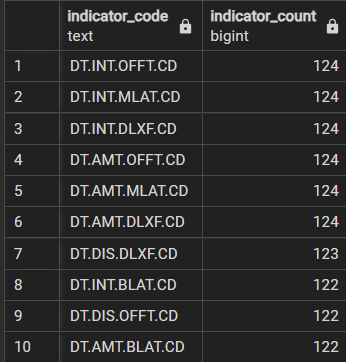

# World-Bank-International-Debt-Data-Analysis
In this project, a thorough analysis is conducted of international debt data collected and provided by the World Bank. As I explore this dataset, I aim to provide valuable insights into the world of international debt, focusing on developing countries. We will seek answers to pivotal questions to better understand the global economic landscape.

## Requirements
- Postgresql 15
- pgAdmin 4

## Databases
ER Model


## Queries
- ## Finding the number of distinct countries
```
SELECT COUNT(DISTINCT country_name) AS total_distinct_countries
FROM international_debt;
```


- ## Finding out the distinct debt indicators
```
SELECT DISTINCT indicator_code AS distinct_debt_indicators
FROM international_debt
ORDER BY distinct_debt_indicators;
```


- ## Totaling the amount of debt owed by the countries
```
SELECT 
    ROUND(SUM (debt) / 1000000, 2) AS total_debt
FROM international_debt;
```


- ## Country with the highest debt
```
SELECT 
    country_name,
    SUM(debt) AS total_debt
FROM international_debt
GROUP BY country_name
ORDER BY total_debt DESC
LIMIT 1;
```


- ## Average amount of debt across indicators
```
SELECT 
    indicator_code AS debt_indicator,
    indicator_name,
    AVG(debt) AS average_debt
FROM international_debt
GROUP BY debt_indicator, indicator_name
ORDER BY average_debt DESC
LIMIT 10;
```


- ## The highest amount of principal repayments
```
SELECT 
    country_name, 
    indicator_name
FROM international_debt
WHERE debt = (SELECT 
                 MAX(debt)
             FROM International_debt
             WHERE indicator_code = 'DT.AMT.DLXF.CD');
```


- ## The most common debt indicator
```
SELECT indicator_code,
       COUNT(indicator_code) AS indicator_count
FROM international_debt
GROUP BY indicator_code
ORDER BY indicator_count DESC, indicator_code DESC
LIMIT 20;  
```


- ## Other viable debt issues
```
SELECT country_name,
        ROUND(MAX(debt),2) AS maximum_debt
FROM international_debt
GROUP BY country_name
ORDER BY maximum_debt DESC
LIMIT 10;
```


## Technology Stack
- Postgresql 15
